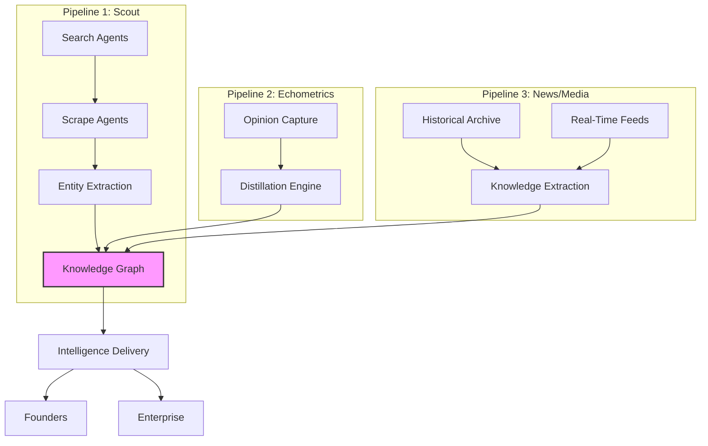
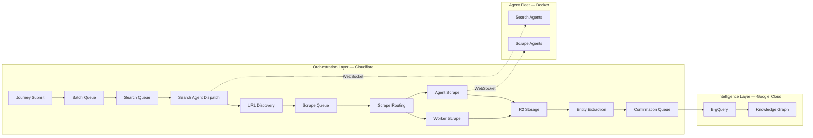
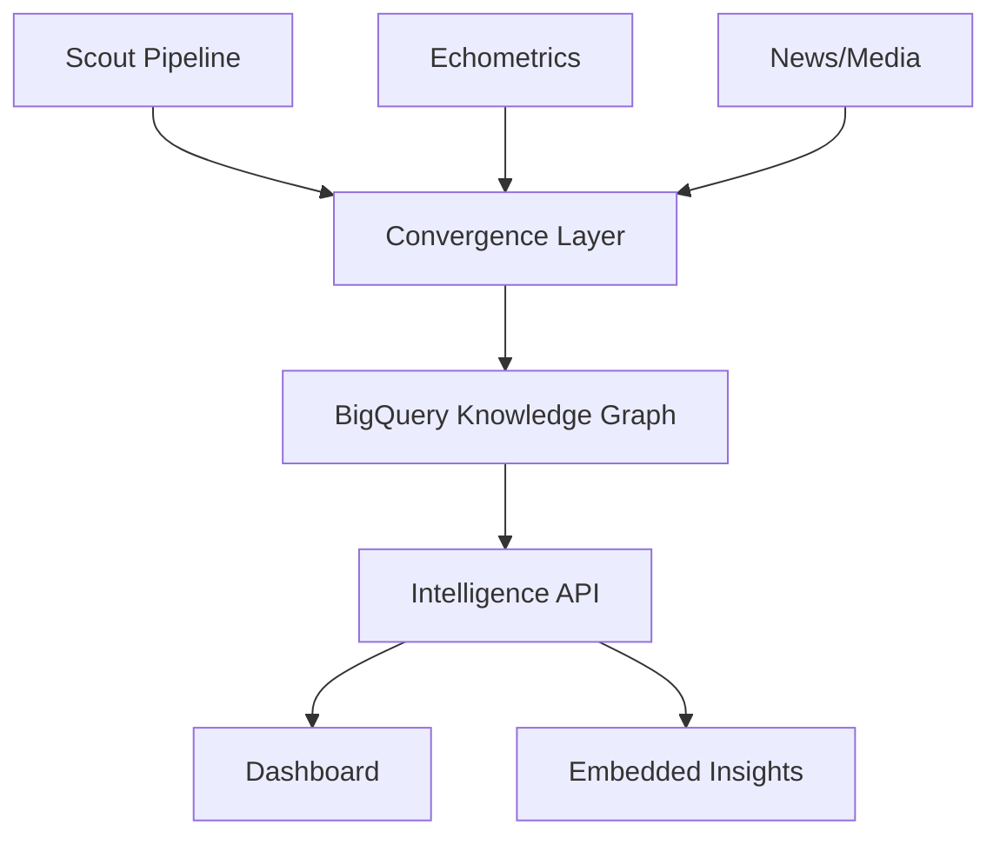

# Platform Architecture Overview — Scale Validation Request

> **Status**: DRAFT — Skeleton. Filling in as questions are answered.
> **Audience**: Cloudflare Solutions Architecture, Google Cloud Partnership
> **Purpose**: Validate infrastructure choices, identify throughput pinch points, align on scaling path
> **Tracking**: See `QUESTIONS.md` for coverage checklist

---

## 1. Executive Summary

<!-- Q1.1, Q1.2, Q1.3 needed -->

[PLATFORM NAME] is a [one-liner pitch]. It serves [customer segments] by converging three knowledge pipelines into a unified intelligence layer:

1. **Scout** — Web-scale search, scrape, and entity extraction pipeline
2. **Echometrics** — Community opinion capture and distillation engine
3. **[News/Media Pipeline Name]** — Historical archive (15 years) + real-time global news intelligence

Each pipeline collects, extracts, and structures knowledge independently. They converge into a shared intelligence layer that delivers actionable insights at scale.

---

## 2. Architecture — Three Pipelines, One Knowledge Graph

<!-- This is intentionally abstract. Detail level depends on Q7 answers. -->

---

## 3. Pipeline 1: Scout — Current Architecture

### Infrastructure (Cloudflare-Native)

| Resource | Count | Purpose |
|----------|-------|---------|
| Workers | 5 | Coordinator, Scraper, Dashboard, Knowledge Pipeline, Upload |
| Durable Objects | 3 | Orchestration, Caching, R2 Upload Management |
| Queues | 13 | Event-driven pipeline (7 primary + 6 DLQ) |
| D1 Database | 1 | Transactional state (journeys, batches, searches, URLs) |
| R2 Buckets | 2 | Scraped content storage + configuration |
| KV Namespaces | 2 | Caching + token management |
| Analytics Engine | 2 datasets | Telemetry and metrics |

### Pipeline Flow

### Key Architectural Patterns

<!-- Detail level depends on Q7 answers -->

- **Durable Object Orchestrator**: Write-locally-first pattern using DO SQLite as a durable buffer, with periodic batch-flush to D1. Provides sub-millisecond writes with full durability guarantees.
- **Queue-as-Retry**: Cloudflare Queues provide built-in retry with DLQ. No custom retry timers needed.
- **Batch-First at Scale**: All queue consumers process in batches (up to 100). One DB operation per batch, not per item.
- **Two-Tier Entity Extraction**: Generic founder intelligence (always-on) + domain-specific extraction (routed by metadata). Compiled pattern matching, not LLM-per-document.

### Current Scale

| Metric | Current | Target |
|--------|---------|--------|
| Registered Agents | 11 | 10,000 - 20,000 |
| Searches/hr | <!-- current --> | 100,000 |
| URLs/hr | <!-- current --> | 1,000,000 |
| Entity Types | 117 | ~300+ (30 core + domain-specific) |
| Domains Covered | 39 | 39 (213 subdomains) |

---

## 4. Pipeline 2: Echometrics

<!-- Q2.1 - Q2.8 needed -->

**[AWAITING INPUT]**

### Purpose
<!-- Q2.2, Q2.7 -->

### Architecture
<!-- Q2.1, Q2.3 -->

### Scale Targets
<!-- Q2.4 -->

### Convergence with Scout
<!-- Q2.6 -->

---

## 5. Pipeline 3: News/Media Intelligence

<!-- Q3.1 - Q3.7 needed -->

**[AWAITING INPUT]**

### Purpose
<!-- Historical + real-time -->

### Architecture
<!-- Q3.4 -->

### Data Sources
<!-- Q3.2 -->

### Scale Targets
<!-- Q3.3 -->

### Convergence with Scout
<!-- Q3.6, Q3.7 -->

---

## 6. Convergence Layer

<!-- Q4.1 - Q4.4 needed -->

### Shared Entity Model
<!-- Q4.2 -->

### Query Layer
<!-- Q4.3, Q4.4 -->

---

## 7. Scaling Concerns — Pinch Points

> These are the architectural chokepoints we've identified. We're seeking validation and guidance on mitigation strategies.

### 7.1 Cloudflare-Specific Concerns

#### 7.1.1 D1 Write Throughput
<!-- Q8.1 -->

**Current**: Single D1 database serves all 5 workers. The Orchestrator MDO batches writes (alarm-flush pattern), reducing round-trips from millions to thousands per hour.

**At Scale**: At 1M URLs/hr, even with batching, D1 becomes the single write bottleneck. Every URL state transition ultimately lands in D1.

**Question for Cloudflare**: What is the practical sustained write throughput for a single D1 database? At what point do we need to shard (multiple D1 databases by journey/sector)?

#### 7.1.2 Durable Object Serialization
<!-- Q8.2 -->

**Current**: The Search Coordinator DO is a singleton (`idFromName('global')`). All agent WebSocket connections route through one instance.

**At Scale**: 10-20K agents all connecting to a single DO instance. DO processes requests serially (input gate). WebSocket dispatch and result collection all serialize through one object.

**Question for Cloudflare**: What are the practical limits of a single DO instance for WebSocket fan-out? At what connection count does this pattern break? Should we shard by agent pool or geographic region?

#### 7.1.3 Queue Throughput
<!-- Q8.3 -->

**Current**: 7 primary queues, max_batch_size=100. Pipeline is event-driven — every URL flows through 3-4 queues (search → scrape → NER → confirmation).

**At Scale**: 1M URLs/hr = ~278 URLs/sec. Each URL touches multiple queues. Total queue message rate could exceed 1,000 msg/sec sustained.

**Question for Cloudflare**: What is the sustained message throughput per queue? Per account? Is there a practical ceiling we should design around?

#### 7.1.4 R2 Event Notification Throughput
<!-- Q8.4 -->

**Current**: Every scraped document is stored in R2 as markdown. R2 `object-create` event triggers the Knowledge Pipeline via queue.

**At Scale**: 1M documents/hr = ~278 object-creates/sec on a single bucket.

**Question for Cloudflare**: Are R2 event notifications rate-limited? At what ops/sec does the notification → queue path introduce latency?

#### 7.1.5 Cross-Worker DO RPC
<!-- Q8.7 -->

**Current**: Coordinator Worker calls ScrapeUploadDO on a separate Worker via service binding. Every scrape result routes through this cross-worker hop.

**At Scale**: Every successful scrape = 1 cross-worker RPC. At 1M URLs/hr, that's ~278 RPCs/sec sustained.

**Question for Cloudflare**: What's the latency profile of cross-worker DO RPC at sustained high throughput? Is co-location guaranteed?

### 7.2 Google Cloud Concerns

#### 7.2.1 BigQuery Ingestion Path
<!-- Q8.5 -->

**Current**: Knowledge Pipeline Worker writes to BigQuery via REST API, using a KV-cached OAuth token.

**At Scale**: Every extracted document = 1+ BigQuery write. At 1M documents/hr, that's ~278 writes/sec from Cloudflare edge to GCP.

**Question for Google**: Should we batch BigQuery writes? Switch to streaming inserts? Use a Pub/Sub intermediary? What's the optimal ingestion pattern from Cloudflare edge to BigQuery?

#### 7.2.2 Cross-Cloud Latency
<!-- -->

**Current**: Cloudflare (edge) → Google Cloud (us-central1?) for every BigQuery write.

**At Scale**: Three pipelines all writing to BigQuery. Combined write rate could be significant.

**Question for Google**: What's the recommended pattern for high-throughput writes from non-GCP infrastructure into BigQuery? Is Cloud Interconnect relevant here?

### 7.3 Agent Fleet Scaling
<!-- Q8.6, Q8.8 -->

#### 7.3.1 WebSocket Connection Limits
<!-- Q8.6 -->

**Current**: 11 agents connect via WebSocket to a single Durable Object.

**At Scale**: 10-20K agents. Single DO instance has connection limits.

**Question**: What's the DO WebSocket connection ceiling? Do we need a sharding layer (agent pools → multiple DOs)?

#### 7.3.2 Agent Compute Infrastructure
<!-- Q8.8 -->

**Current**: Docker containers on a single host. Each agent runs Playwright (headless browser).

**At Scale**: 10-20K headless browsers = significant compute. Each needs ~512MB-1GB RAM.

**Question for both**: Where should the agent fleet run? GKE with autoscaling? Cloudflare Workers + Browser Rendering API? Hybrid? What's the cost model?

---

## 8. Infrastructure Decision Matrix

> Where should each component live? This is the core question for both Cloudflare and Google.

| Component | Current | At Scale | Rationale |
|-----------|---------|----------|-----------|
| Orchestration (queues, state, DOs) | Cloudflare | Cloudflare | Edge-native, low latency |
| Scrape Content Storage (R2) | Cloudflare | Cloudflare | Zero-egress, event notifications |
| Transactional State (D1) | Cloudflare | **?** | D1 throughput ceiling unknown |
| Entity Extraction (KP) | Cloudflare Worker | Cloudflare Worker | CPU-bound but fast (<100ms) |
| Knowledge Graph (BigQuery) | Google Cloud | Google Cloud | Analytics, cross-pipeline queries |
| Agent Fleet (Playwright) | Docker / single host | **?** | Needs fleet orchestration |
| Echometrics | **?** | **?** | TBD |
| News/Media Ingestion | **?** | **?** | TBD |
| Real-Time Intelligence | **?** | **?** | TBD |

---

## 9. Specific Questions for Cloudflare

1. **D1 ceiling**: Sustained write throughput for a single D1 database under batch workloads (100-row batches, UPSERT-heavy)?
2. **DO scalability**: Max WebSocket connections per DO instance? Recommended sharding pattern for 10K+ connections?
3. **Queue throughput**: Sustained messages/sec per queue and per account? Any backpressure mechanisms?
4. **R2 notifications**: Rate limits on event notifications per bucket?
5. **Workers CPU**: Current 30-second CPU limit per invocation — is this increasing? Our entity extraction runs <100ms but batch processing could chain longer.
6. **Account-level limits**: At 5 Workers + 3 DOs + 13 Queues + expanding, are there account-level ceilings we should plan around?
7. **Browser Rendering API**: Is this viable as an alternative to self-hosted Playwright at scale? What's the pricing model at 1M pages/hr?

## 10. Specific Questions for Google Cloud

1. **BigQuery ingestion**: Optimal pattern for high-throughput writes from Cloudflare Workers? Streaming inserts vs batch loads vs Pub/Sub intermediary?
2. **Cross-cloud networking**: Cloudflare ↔ GCP latency and throughput. Cloud Interconnect relevance?
3. **Agent fleet**: GKE vs Cloud Run for 10-20K headless browser agents? Autoscaling characteristics?
4. **Cost model**: At our projected scale, what GCP services should we lock in pricing for?
5. **News/Media pipeline**: If real-time ingestion is GCP-native, what's the recommended stack? (Pub/Sub → Dataflow → BigQuery?)

---

## Appendix A: Current Resource Inventory (Scout v1)

| Resource | Count | Details |
|----------|-------|---------|
| Cloudflare Workers | 5 | Coordinator, Upload, Dashboard, Scraper, Knowledge Pipeline |
| Durable Objects | 3 | Orchestrator, Cache (being removed), Upload Manager |
| D1 Databases | 1 | All transactional state |
| R2 Buckets | 2 | Content storage + config |
| Queues | 13 | 7 primary + 6 DLQ |
| KV Namespaces | 2 | Cache + tokens |
| Analytics Engine | 2 datasets | Telemetry |
| Agent Fleet | 11 agents | Docker-hosted, WebSocket-connected |

## Appendix B: Technology Stack

| Layer | Technology | Why |
|-------|-----------|-----|
| Edge Orchestration | Cloudflare Workers | Global edge, sub-ms routing |
| Stateful Coordination | Durable Objects (SQLite) | Durable state + compute co-located |
| Event Pipeline | Cloudflare Queues | Built-in retry, DLQ, batch consumption |
| Content Storage | Cloudflare R2 | Zero egress, S3-compatible, event notifications |
| Transactional DB | Cloudflare D1 (SQLite) | Queryable shared state |
| Entity Extraction | Custom (compiled pattern matching) | Sub-100ms, no LLM per document |
| Knowledge Graph | Google BigQuery | Cross-pipeline analytics, SQL interface |
| Agent Compute | Docker + Playwright | Headless browser automation |
| Agent Protocol | WebSocket (via DO) | Real-time bidirectional dispatch |
