# Mermaid Diagram Test - All Types

Open this file in Cursor's Enhanced Preview (Cmd+Shift+V / Ctrl+Shift+V) to verify that every diagram renders correctly with each MVP Scale theme.

Current theme: ____________________

---

## 1. Flowchart

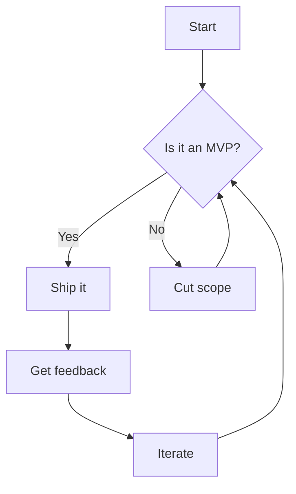

## 2. Flowchart (Left to Right)

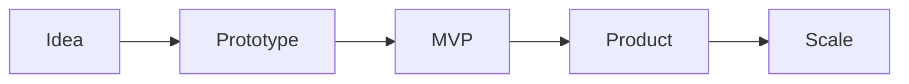

## 3. Sequence Diagram

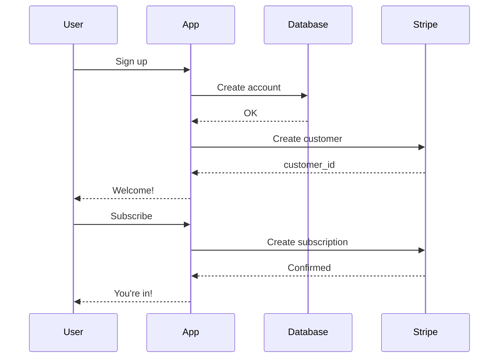

## 4. Class Diagram

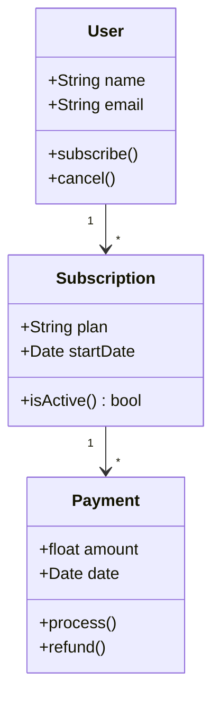

## 5. State Diagram

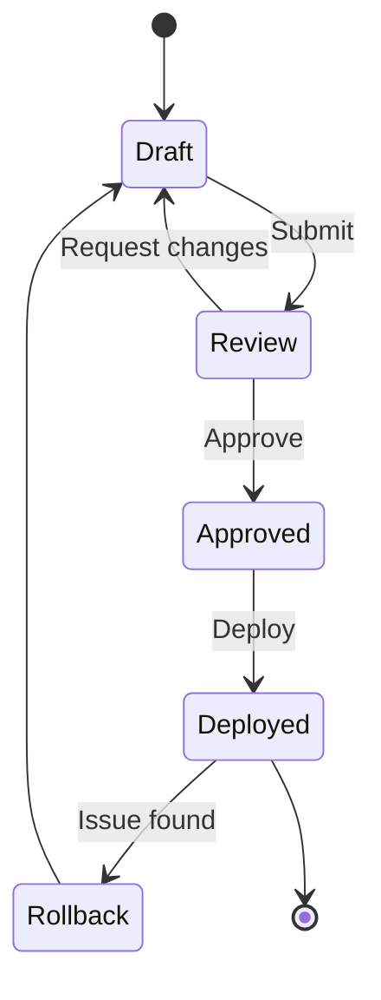

## 6. Entity Relationship Diagram

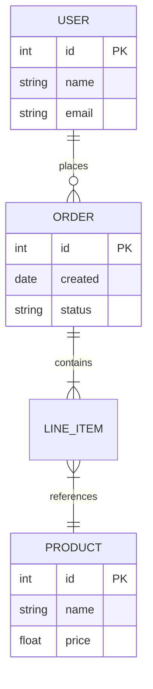

## 7. Gantt Chart

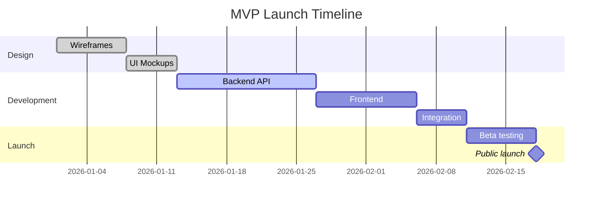

## 8. Pie Chart

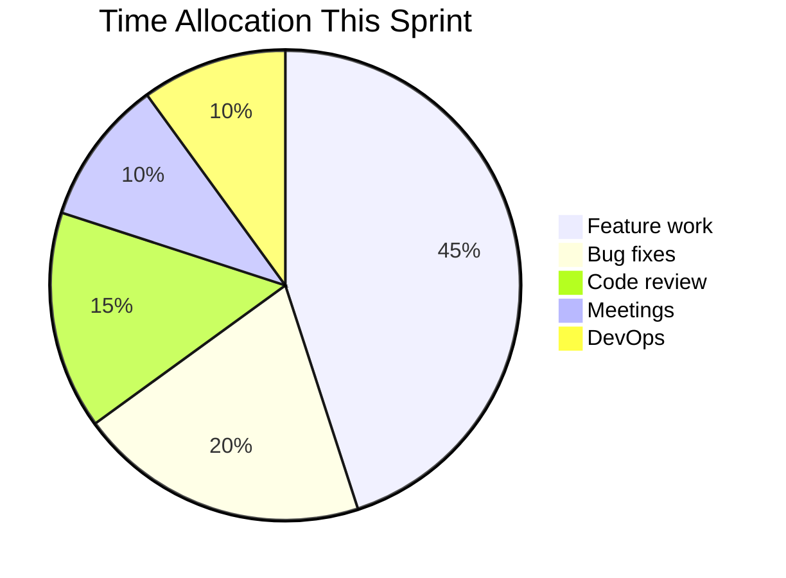

## 9. User Journey

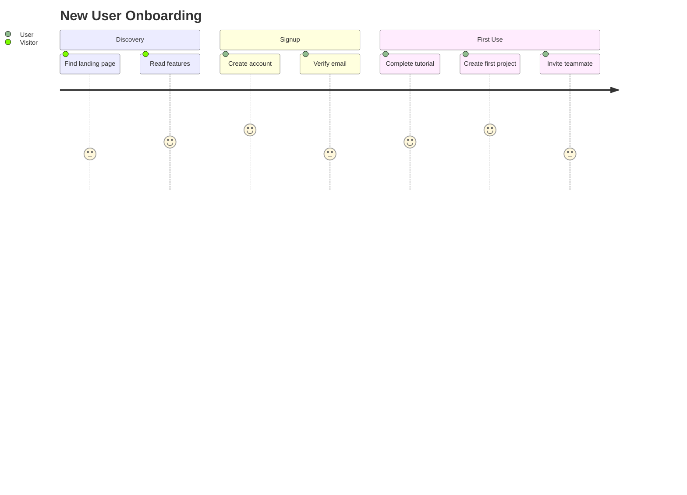

## 10. Git Graph

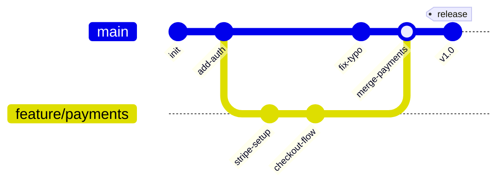

## 11. Mindmap

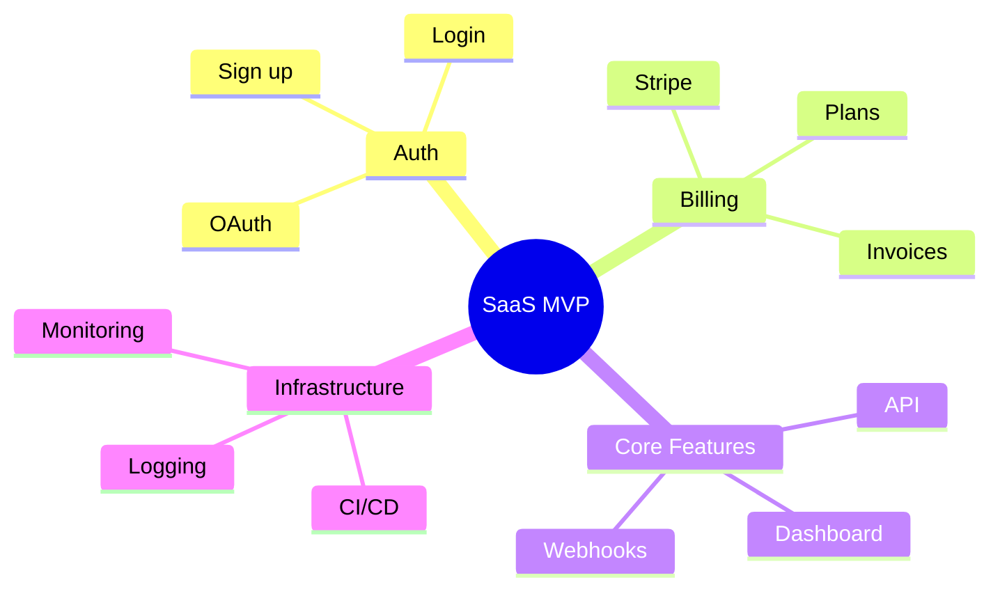

## 12. Timeline

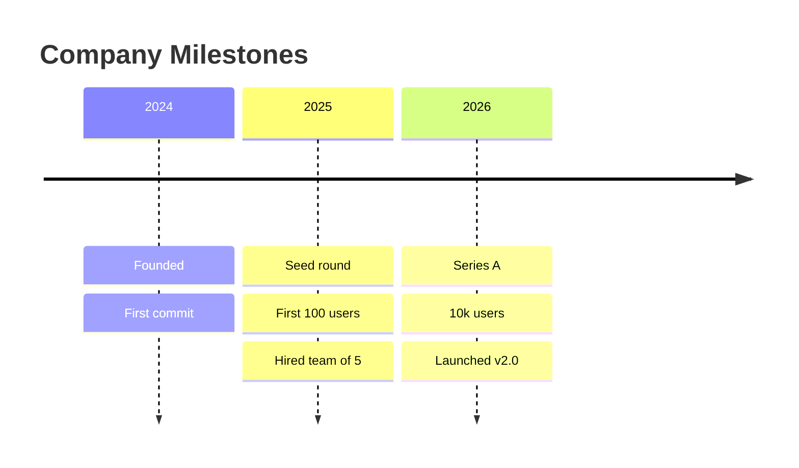

## 13. Quadrant Chart

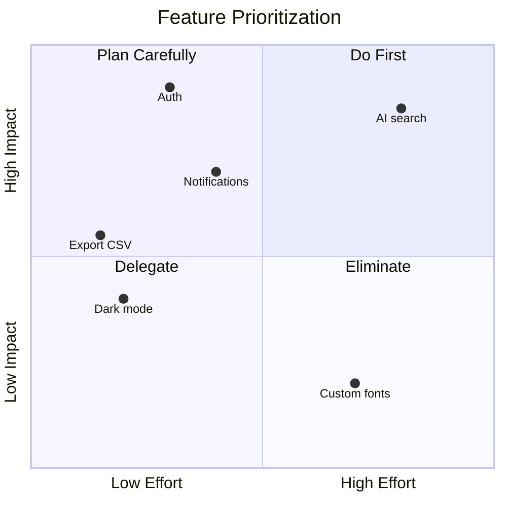

## 14. XY Chart (Bar)

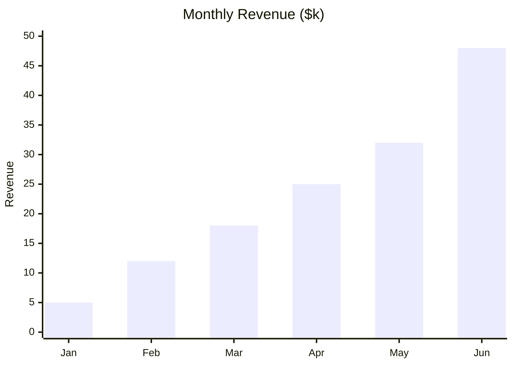

## 15. XY Chart (Line)

```mermaid
xychart-beta
    title "Active Users"
    x-axis [Jan, Feb, Mar, Apr, May, Jun]
    y-axis "Users" 0 --> 1000
    line [50, 120, 310, 480, 720, 950]
```

## 16. Sankey Diagram

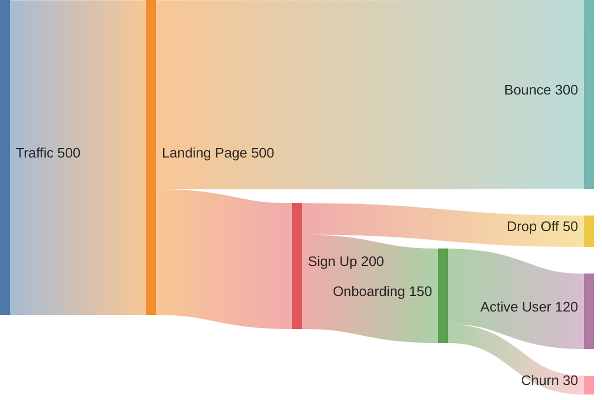

## 17. Block Diagram

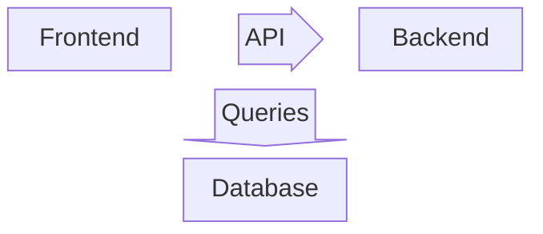

## 18. Packet Diagram

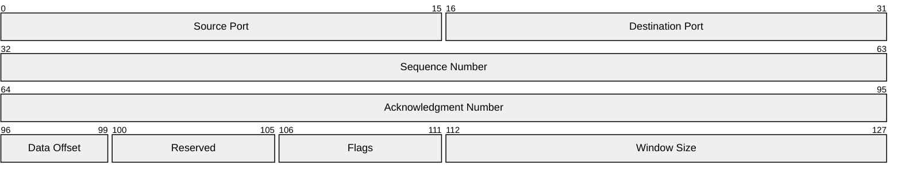

## 19. Kanban

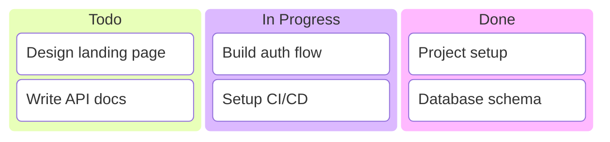

---

## Theme Checklist

After previewing, note which theme you're on and any rendering issues:

| Theme | Diagrams OK? | Text Legible? | Notes |
|---|---|---|---|
| Founder Mode | | | |
| Ship It | | | |
| Seed Round | | | |
| Series A | | | |
| Ramen Profitable | | | |
| Pivot | | | |
| Unicorn | | | |
| Demo Day | | | |
| Late Night Deploy | | | |
| Exit Strategy | | | |
